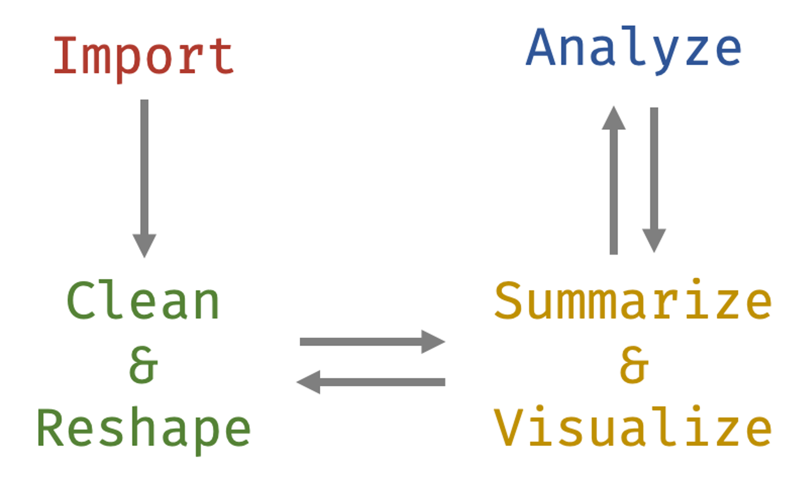
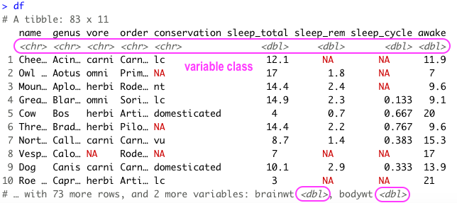
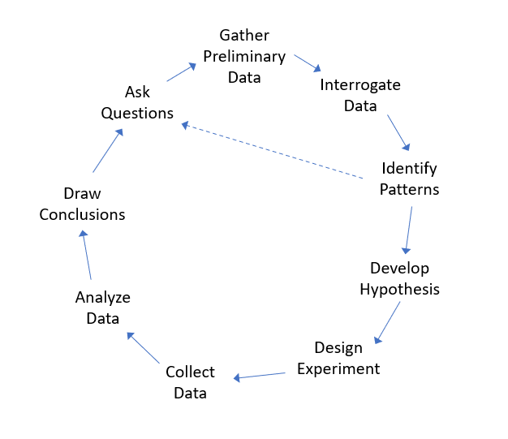
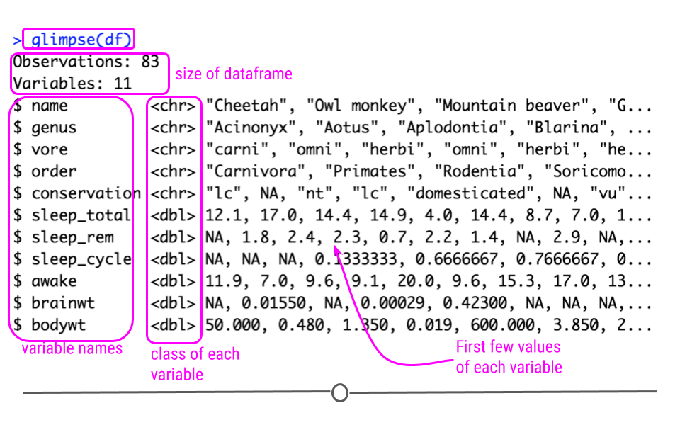

```{r setup, include=FALSE}
library(learnr)
library(tidyverse)
library(janitor)
library(naniar)
library(here)
library(skimr)
library(explore)
library(dplyr)
library(eeptools)
library(rio)
library(usydColours)
library(GGally)
theme_set(theme_minimal())
knitr::opts_chunk$set(echo = FALSE, warning = FALSE)


destfile <- "stack-overflow-developer-survey-2023.zip"
if (!file.exists(destfile)){
url <- 'https://cdn.stackoverflow.co/files/jo7n4k8s/production/49915bfd46d0902c3564fd9a06b509d08a20488c.zip/stack-overflow-developer-survey-2023.zip'
download.file(url, destfile)
}

zip_file <- "stack-overflow-developer-survey-2023.zip"
survey_raw <- readr::read_csv(unz(zip_file, 
                         'survey_results_public.csv'))

survey_cleaned <- survey_raw %>%
  clean_names()

zip_file_schema <- "stack-overflow-developer-survey-2023.zip"
survey_schema <- read_csv(unz(zip_file_schema, 
                         'survey_results_schema.csv')) %>%
  clean_names()

lookup <- c(salary_usd = "converted_comp_yearly", 
            profession = "main_branch",
            coding_as_hobby = "coding_activities",
            years_professional_coding = "years_code_pro",
            company_size = "org_size",
            years_work_exp = "work_exp",
            manager_role = "i_cor_pm")

survey_renamed <- survey_cleaned %>%
  rename(all_of(lookup))

survey_hobby <- survey_renamed %>% 
  mutate(coding_as_hobby_clean = case_when(
    grepl("I don’t code outside of work", coding_as_hobby) ~ "no",
    grepl("Bootstrapping a business", coding_as_hobby) ~ "no",
    grepl("Freelance/contract work", coding_as_hobby) ~ "no",
    TRUE ~ "yes"))

survey_employment <- survey_hobby %>% 
  mutate(employment_clean = case_when(
    grepl("Employed", employment) & grepl("Not employed", employment) ~ "unknown",
    grepl("but", employment) & grepl("and", employment) ~ "unknown",
    TRUE ~ employment))

survey_empl_cleaned <- survey_employment %>% 
  mutate(employment_clean = case_when(
    grepl("Employed", employment_clean) ~ "employed",
    grepl("freelancer", employment_clean) ~ "self_employed",
    grepl("Student", employment_clean) ~ "student",
    grepl("Retired", employment_clean) ~ "retired",
    grepl("Not employed", employment_clean) ~ "not_employed",
    grepl("I prefer not to say", employment_clean) ~ "unknown",
    TRUE ~ employment_clean))

survey_prof <- survey_empl_cleaned %>%
  mutate(years_professional_coding_clean = case_when(
      years_professional_coding == "Less than 1 year" ~ 0,
      years_professional_coding == "More than 50 years" ~ 51,
      TRUE ~ as.numeric(years_professional_coding)))

survey_code <- survey_prof %>%
  mutate(years_code_clean = case_when(
      years_code == "Less than 1 year" ~ 0,
      years_code == "More than 50 years" ~ 51,
      TRUE ~ as.numeric(years_code)))

survey_company <- survey_code %>%
  mutate(company_size_clean = factor(company_size,
                               levels = c("Just me - I am a freelancer, sole proprietor, etc.)",
                                          "2 to 9 employees",
                                          "10 to 19 employees",
                                          "20 to 99 employees",
                                          "100 to 499 employees",
                                          "500 to 999 employees",
                                          "1,000 to 4,999 employees",
                                          "5,000 to 9,999 employees",
                                          "10,000 or more employees",
                                          "I don’t know"),
                                          labels = c("1",
                                          "2-9",
                                          "10-19",
                                          "20-99",
                                          "100-499",
                                          "500-999",
                                          "1,000-4,999",
                                          "5,000-9,999",
                                          ">10,000",
                                          "unknown")))

survey_age <- survey_company %>%
  mutate(age_clean = factor(age,
                               levels = c("Under 18 years old",
                                          "18-24 years old",
                                          "25-34 years old",
                                          "35-44 years old",
                                          "45-54 years old",
                                          "55-64 years old",
                                          "65 years or older",
                                          "Prefer not to say"),
                                          labels = c("<18",
                                                     "18-24",
                                                     "25-34",
                                                     "35-44",
                                                     "45-54",
                                                     "55-64",
                                                     ">65",
                                                     "unknown")))

survey_filtered <- survey_age %>%
  filter(profession == 'I am a developer by profession') %>% 
  filter(employment_clean == 'employed' | employment_clean == 'self_employed')

survey_sel <- survey_filtered %>%
  select(-all_of(c("q120", "survey_ease", "survey_length", "t_branch")))

survey_country <- survey_sel %>%
  mutate(country = case_when(
    country == 'United Kingdom of Great Britain and Northern Ireland' ~ 'United Kingdom',
    country == 'Venezuela, Bolivarian Republic of...' ~ 'Venezuela',
    country == 'Iran, Islamic Republic of...' ~ 'Iran',
    country == 'United States of America' ~ 'United States',
    country == 'Congo, Republic of the...' ~ 'Democratic Republic of the Congo', 
    .default = country
    ))

survey_resp <- survey_country %>%
  inner_join(country_n_resp, by = "country")

survey_remote <- survey_resp %>%
  drop_na(remote_work)

survey_proc <- survey_remote %>%
  mutate(salary_usd = salary_usd %>%
           is.na %>%
           ifelse(median_salary, salary_usd))
```

## Welcome!

This tutorial aims at giving you a starter to independently work with your data throughout the *"data analysis lifecycle"* --- from **importing**, **cleaning**, **visualising** and **summarizing** the data to **analyzing**.



To follow this tutorial, you need some familiarity with **tidyverse** packages like *dplyr* and *ggplot2*.

**Now let's get started!**

::: callout-note
## Learning objectives

-   Understand data-type constraints, checks and the role of data cleaning techniques in standardising data formats, handling missing values, and addressing outliers;
-   Develop exploratory data analysis skills to visualise data distributions, detect outliers, and explore relationships between variables.
:::

Incorrect or inconsistent data leads to false conclusions. And so, how well you clean and understand the data has a high impact on the quality of the results.

In fact, a simple algorithm can outweigh a complex one just because it was given enough and high-quality data.

For these reasons, it is important to have a step-by-step guideline, a cheat sheet, that walks through the quality checks to be applied.

### The dataset

## The dataset

The *Stack Overflow Developer Survey* is a highly anticipated annual event that provides valuable insights into the preferences, trends, and experiences of developers worldwide. In May 2023, over 90,000 developers participated in the survey, sharing their perspectives on learning methods, preferred tools, and salary trends. The [latest dataset 2023](https://survey.stackoverflow.co/2023/#overview) is available [here](https://insights.stackoverflow.com/survey/).

This is the voice of the developer. Analysts, IT leaders, reporters, and other developers turn to this report to stay up to date with the evolving developer experience, technologies that are rising or falling in favor, and to understand where tech might be going next.

EDA lacks a formal structure with a strict set of rules. In the early stages of EDA you are encouraged to explore every idea that comes to mind. While some of these ideas will prove fruitful, others may lead to dead ends. As your exploration continues, you will narrow down a few insightful findings that you’ll eventually write up and communicate to others.

### Import your data

We can read .csv files into R using `read_csv()`. The first argument is the most important: the path to the file. You can think about the path as the address of the file: the file is called `survey_results_public.csv` and that it lives in the `data` folder.

```{r read_csv, exercise=TRUE}
survey_zip_file <- here("data", "stack-overflow-developer-survey-2023.zip")

survey_raw <- readr::____(unz(survey_zip_file, 
                         'survey_results_public.csv'))
```

```{r skim-solution}
survey_zip_file <- here("data", "stack-overflow-developer-survey-2023.zip")

survey_raw <- readr::read_csv(unz(survey_zip_file, 
                         'survey_results_public.csv'))
```

You can read more about how to get different formats of data types into R [here](https://jhudatascience.org/tidyversecourse/get-data.html).

Now that we have seen how to import a dataset, we can start the process of "cleaning" it. Cleaning, processing, wrangling, tidying, etc are all synonyms you may have heard being used for this process.

#### Data semantics

A dataset is a collection of *values*, usually either numbers (if quantitative) or strings (if qualitative). Every value belongs to a **variable** and an **observation**:

-   A variable contains all values that measure the same underlying attribute (like height, temperature, duration) across units;

-   An observation contains all values measured on the same unit (like a person, or a day, or a race) across attributes.

A dataset is messy or clean/tidy depending on how rows and columns are matched up with observations and variables. In **tidy data**:

-   Each variable is a column;

-   Each observation is a row;

-   Each cell is a single measurement.

> Ref. [*Hadley Wickham's 2014 "Tidy Data" paper in the Journal of Statistical Software*](https://vita.had.co.nz/papers/tidy-data.pdf)


**Messy data** is any other arrangement of the data. There are common problems that can arise when dealing with messy datasets. There are a number of actions you can take on a dataset to tidy the data depending on the problem. These include: *filtering*, *transforming*, *modifying variables*, *aggregating the data*, and *sorting the order of the observations*. We will see some of this later in this tutorial.

Here is a [link](https://ds4biomed.tech/clean-data-tidy) to some material you can use to better understand how to tidy messy datasets.

::: callout-tip
## It's your turn!

Have a look at your `survey_raw` object. It is stored as a tibble.

> Tibbles have a refined print method that shows only the first 10 rows, and all the columns that fit on screen. This makes it much easier to work with large data. In addition to its name, each column reports its type. Tibbles are designed so that you don't accidentally overwhelm your console when you print large data frames.

Is your dataset tidy or messy?

```{r tibble, exercise=TRUE}
____
```

```{r tibble-solution}
survey_raw
```
:::

Because the data is in tibble format, we can gain a lot of information by just viewing the data itself.



In this course, we'll be using **tidyverse** packages for getting to know your data, manipulating it, and visualizing it. The tidyverse is a collection of R packages designed for data science that share common APIs and an underlying philosophy. When you type library(tidyverse), what you're doing is loading this collection of related packages for handling data using tidy data principles. These packages include *ggplot2* for data visualization, and *dplyr* and *tidyr* for data manipulation and transformation. During this course, we'll point out when we use functions from these different packages.

You can visit this page to learn more about tidyverse: <https://www.tidyverse.org/learn/>.

::: callout-note
## Summary

-   You can import data into R using the `read_csv()` function;
-   In order to work with messy data easily, you'll have to get them into a tidy data format.
:::

## Inspection and cleaning

Data cleaning is an iterative process:

-   We won't get everything right the first time around;
-   We might improve or find a better way;
-   There isn't always a clear place to start, but we have to start somewhere.



One good place to start is getting an overview of the dataset and use `glimpse()` to check for *data-type constraints*.

> DATA-TYPE CONSTRAINTS: Make sure numbers are stored as numerical data types. A date should be stored as a date object, and so on.

If you have a bunch of inconsistently named columns and it would be painful to fix them all by hand, the `clean_names()` function from the **janitor** package provides a useful automated cleaning. **janitor** has simple functions for *examining and cleaning dirty data*. `clean_names()` works in a `%>%` pipeline, and handles problematic variable names, especially those that are so well-preserved by `readr::read_csv()`.

-   Parses letter cases and separators to a consistent format:

    -   Default is to snake_case, but other cases like camelCase are available

-   Handles special characters and spaces, including transliterating characters like `œ` to `oe`;

-   Appends numbers to duplicated names;

-   Converts "%" to "percent" and "\#" to "number" to retain meaning;

-   Spacing (or lack thereof) around numbers is preserved

::: callout-tip
## It's your turn!

Let's introduce a few major themes in this tidyverse. First, the pipe operator -- `%>%`. It helps simplify the code and makes things more readable. It takes what is on the left hand side and puts it in the right hand side's function.

Clean the `data_raw` variable names with `clean_names()`, returning a `data_clean` object:

```{r clean, exercise=TRUE}
survey_cleaned <- survey_raw %>%
  _____
```

```{r clean-solution}
survey_cleaned <- survey_raw %>%
  clean_names()
```
:::

The above code takes the data frame `data_raw` and puts it into the `clean_names()` function. This does the same thing as `clean_names(data_raw)`:

```{r}
survey_cleaned <- clean_names(survey_raw)
```

### Get a glimpse of your data

The `glimpse()` function of the *dplyr* package can help you to see what data you are working with. It prints for you columns running down the page, and data running across. This makes it possible to see every column in your data frame:



```{r}
survey_cleaned %>%
  glimpse()
```

The data we currently have contains 84 columns and that's a large amount of info. We can notice that:

-   the first variable looks like a unique identifier. Each subject should have their own ID such that all data are properly attributed to that subject. Often, it can be helpful to have a way of recording the source of each row in our original dataset (in this case, our subject), so we can trace the data from this row as we work with the data. The `isid()` function returns a check TRUE/FALSE whether or not the variables together uniquely identify a row in the dataframe:

```{r}
isid(survey_cleaned, 
     vars = c("response_id"), 
     verbose = TRUE)
```

> UNIQUE CONSTRAINT: a particular observation unit identifiable and distinct from all other observational units

-   most variables are categorical and some have too many levels. For example, the `coding_activities` variable has many levels. We may want to collapse these levels into fewer categories for several reasons:
    -   Collapsing levels can simplify the analysis and interpretation of results, especially when dealing with a large number of categories;
    -   In predictive modeling, reducing the number of levels in categorical variables can help improve model performance by reducing the complexity of the model;
    -   Collapsing infrequent levels into broader categories can help address issues of sparsity, where certain levels have very few observations, which may lead to unreliable estimates.

```{r}
#count the frequency of each level in the 'coding_activities' variable
#this variable represents whether respondents code as a hobby or only for work
survey_cleaned %>%
  count(coding_activities) %>%
  arrange(desc(n))
```

-   some variable names are not easily understandable. For example, the column `converted_comp_yearly` stands for the annual salary of the respondents in USD. We can change the name of column to `salary_usd` for easier understanding.

**Details on the questions asked in the survey are provided in the document *survey_result_schema.csv*:**

```{r}
zip_file_schema <- here("data", "stack-overflow-developer-survey-2023.zip")
survey_schema <- read_csv(unz(zip_file_schema, 
                         'survey_results_schema.csv')) %>%
  clean_names()

survey_schema
```

Now we can better rename those variables that are not easily understandable. Whenever you are creating a name for something in R, **be clear and descriptive**.

```{r}
survey_cleaned %>%
  colnames()

#columns to be renamed
lookup <- c(salary_usd = "converted_comp_yearly", 
            profession = "main_branch",
            coding_as_hobby = "coding_activities",
            years_professional_coding = "years_code_pro",
            company_size = "org_size",
            years_work_exp = "work_exp",
            manager_role = "i_cor_pm")

#rename columns
survey_renamed <- survey_cleaned %>%
  rename(all_of(lookup))

survey_renamed %>%
  colnames()
```

Let's have a look at the variable `coding_as_hobby`:

```{r}
survey_renamed %>%
  count(coding_as_hobby) %>%
   arrange(desc(n))
```

There are lots of values and in this case it would be much easier to make this variable binary (`yes`- the respondent codes outside of work (as hobby); `no`- the respondent doesn't code outside of work). When we want to add and/or change variables we can use `mutate()` from the *dplyr* package. We grab `data_clean`, and create a variable called `coding_as_hobby_clean` using the `coding_as_hobby` variable and assign it back into `data_clean`. The benefit is in the readability of the code. We repeat things like the name of the data frame much less:

```{r}
#map each value to either “yes” or “no”
survey_hobby <- survey_renamed %>% 
  mutate(coding_as_hobby_clean = case_when(
    grepl("I don’t code outside of work", coding_as_hobby) ~ "no",
    grepl("Bootstrapping a business", coding_as_hobby) ~ "no",
    grepl("Freelance/contract work", coding_as_hobby) ~ "no",
    TRUE ~ "yes"))
```

> The word "grepl" stands for "grep logical". The `grepl()` function in R searches for matches in characters or sequences of characters present in a given string. `grepl()` returns `TRUE` if the given pattern is present in the vector. Otherwise, it returns `FALSE`.

::: callout-tip
## It's your turn!

How can you visualise how many respondents engage in coding as a hobby? Compare how the `coding_as_hobby` and `coding_as_hobby_clean` variables are visualised in a bar plot using the `geom_bar()` function from the *ggplot2* package:

```{r bar_plot, exercise=TRUE}
# coding_as_hobby variable
survey_hobby %>%
  ggplot() + 
  ____(aes(x = ____)) +
  theme_classic() #a classic-looking theme, with x and y axis lines and no gridlines

# coding_as_hobby_clean variable
survey_hobby %>%
  ggplot() + 
  ____(aes(x = ____)) +
  theme_classic() 
```

```{r bar_plot-solution}
# coding_as_hobby variable
survey_hobby %>%
  ggplot() + 
  geom_bar(aes(x = coding_as_hobby)) +
  theme_classic() #a classic-looking theme, with x and y axis lines and no gridlines

# coding_as_hobby_clean variable
survey_hobby %>%
  ggplot() + 
  geom_bar(aes(x = coding_as_hobby_clean)) +
  theme_classic() 
```
:::