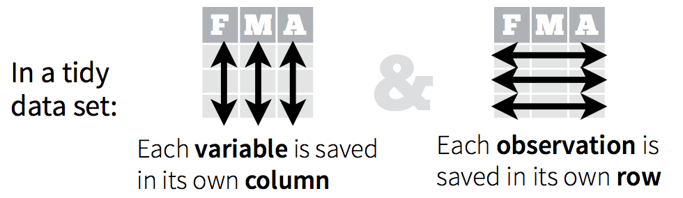

```{r setup, include=FALSE}
library(learnr)
library(tidyverse)
library(janitor)
library(naniar)
library(here)
library(skimr)
library(explore)
library(dplyr)
library(eeptools)
library(rio)
library(usydColours)
library(GGally)
theme_set(theme_minimal())
knitr::opts_chunk$set(echo = FALSE, warning = FALSE)

destfile <- "stack-overflow-developer-survey-2023.zip"
if (!file.exists(destfile)){
url <- 'https://cdn.stackoverflow.co/files/jo7n4k8s/production/49915bfd46d0902c3564fd9a06b509d08a20488c.zip/stack-overflow-developer-survey-2023.zip'
download.file(url, destfile)
}

zip_file <- "stack-overflow-developer-survey-2023.zip"
survey_raw <- readr::read_csv(unz(zip_file, 
                         'survey_results_public.csv'))

survey_cleaned <- survey_raw %>%
  clean_names()

zip_file_schema <- "stack-overflow-developer-survey-2023.zip"
survey_schema <- read_csv(unz(zip_file_schema, 
                         'survey_results_schema.csv')) %>%
  clean_names()

lookup <- c(salary_usd = "converted_comp_yearly", 
            profession = "main_branch",
            coding_as_hobby = "coding_activities",
            years_professional_coding = "years_code_pro",
            company_size = "org_size",
            years_work_exp = "work_exp",
            manager_role = "i_cor_pm")

survey_renamed <- survey_cleaned %>%
  rename(all_of(lookup))

survey_hobby <- survey_renamed %>% 
  mutate(coding_as_hobby_clean = case_when(
    grepl("I don’t code outside of work", coding_as_hobby) ~ "no",
    grepl("Bootstrapping a business", coding_as_hobby) ~ "no",
    grepl("Freelance/contract work", coding_as_hobby) ~ "no",
    TRUE ~ "yes"))

survey_employment <- survey_hobby %>% 
  mutate(employment_clean = case_when(
    grepl("Employed", employment) & grepl("Not employed", employment) ~ "unknown",
    grepl("but", employment) & grepl("and", employment) ~ "unknown",
    TRUE ~ employment))

survey_empl_cleaned <- survey_employment %>% 
  mutate(employment_clean = case_when(
    grepl("Employed", employment_clean) ~ "employed",
    grepl("freelancer", employment_clean) ~ "self_employed",
    grepl("Student", employment_clean) ~ "student",
    grepl("Retired", employment_clean) ~ "retired",
    grepl("Not employed", employment_clean) ~ "not_employed",
    grepl("I prefer not to say", employment_clean) ~ "unknown",
    TRUE ~ employment_clean))

survey_prof <- survey_empl_cleaned %>%
  mutate(years_professional_coding_clean = case_when(
      years_professional_coding == "Less than 1 year" ~ 0,
      years_professional_coding == "More than 50 years" ~ 51,
      TRUE ~ as.numeric(years_professional_coding)))

survey_code <- survey_prof %>%
  mutate(years_code_clean = case_when(
      years_code == "Less than 1 year" ~ 0,
      years_code == "More than 50 years" ~ 51,
      TRUE ~ as.numeric(years_code)))

survey_company <- survey_code %>%
  mutate(company_size_clean = factor(company_size,
                               levels = c("Just me - I am a freelancer, sole proprietor, etc.)",
                                          "2 to 9 employees",
                                          "10 to 19 employees",
                                          "20 to 99 employees",
                                          "100 to 499 employees",
                                          "500 to 999 employees",
                                          "1,000 to 4,999 employees",
                                          "5,000 to 9,999 employees",
                                          "10,000 or more employees",
                                          "I don’t know"),
                                          labels = c("1",
                                          "2-9",
                                          "10-19",
                                          "20-99",
                                          "100-499",
                                          "500-999",
                                          "1,000-4,999",
                                          "5,000-9,999",
                                          ">10,000",
                                          "unknown")))

survey_age <- survey_company %>%
  mutate(age_clean = factor(age,
                               levels = c("Under 18 years old",
                                          "18-24 years old",
                                          "25-34 years old",
                                          "35-44 years old",
                                          "45-54 years old",
                                          "55-64 years old",
                                          "65 years or older",
                                          "Prefer not to say"),
                                          labels = c("<18",
                                                     "18-24",
                                                     "25-34",
                                                     "35-44",
                                                     "45-54",
                                                     "55-64",
                                                     ">65",
                                                     "unknown")))

survey_filtered <- survey_age %>%
  filter(profession == 'I am a developer by profession') %>% 
  filter(employment_clean == 'employed' | employment_clean == 'self_employed')

survey_sel <- survey_filtered %>%
  select(-all_of(c("q120", "survey_ease", "survey_length", "t_branch")))

survey_country <- survey_sel %>%
  mutate(country = case_when(
    country == 'United Kingdom of Great Britain and Northern Ireland' ~ 'United Kingdom',
    country == 'Venezuela, Bolivarian Republic of...' ~ 'Venezuela',
    country == 'Iran, Islamic Republic of...' ~ 'Iran',
    country == 'United States of America' ~ 'United States',
    country == 'Congo, Republic of the...' ~ 'Democratic Republic of the Congo', 
    .default = country
    ))

country_n_resp <- 
  survey_country %>% 
  group_by(country) %>% 
  summarise(median_salary = round(median(salary_usd, na.rm = TRUE)), 
            n_resp = n()) %>%
  arrange(desc(n_resp))

survey_resp <- survey_country %>%
  inner_join(country_n_resp, by = "country")

survey_remote <- survey_resp %>%
  drop_na(remote_work)

survey_proc <- survey_remote %>%
  mutate(salary_usd = salary_usd %>%
           is.na %>%
           ifelse(median_salary, salary_usd))
```

## Welcome!

This tutorial aims at giving you a starter to independently work with your data throughout the *"data analysis lifecycle"* --- from **importing**, **cleaning**, **visualising** and **summarizing** the data to **analyzing**.

{width="50%"}

To follow this tutorial, you need some familiarity with **tidyverse** packages like *dplyr* and *ggplot2*.

**Now let's get started!**

## Learning objectives

Incorrect or inconsistent data leads to false conclusions. And so, how well you clean and understand the data has a high impact on the quality of the results.

In fact, a simple algorithm can outweigh a complex one just because it was given enough and high-quality data.

For these reasons, it is important to have a step-by-step guideline, a cheat sheet, that walks through the quality checks to be applied.

With this tutorial you will:

-   Understand data-type constraints, checks and the role of data cleaning techniques in standardising data formats, handling missing values, and addressing outliers;
-   Develop exploratory data analysis skills to visualise data distributions, detect outliers, and explore relationships between variables.

## The dataset

The *Stack Overflow Developer Survey* is a highly anticipated annual event that provides valuable insights into the preferences, trends, and experiences of developers worldwide. In May 2023, over 90,000 developers participated in the survey, sharing their perspectives on learning methods, preferred tools, and salary trends. The [latest dataset 2023](https://survey.stackoverflow.co/2023/#overview) is available [here](https://insights.stackoverflow.com/survey/).

{width="50%"}

This is the voice of the developer. Analysts, IT leaders, reporters, and other developers turn to this report to stay up to date with the evolving developer experience, technologies that are rising or falling in favor, and to understand where tech might be going next.

EDA lacks a formal structure with a strict set of rules. In the early stages of EDA you are encouraged to explore every idea that comes to mind. While some of these ideas will prove fruitful, others may lead to dead ends. As your exploration continues, you will narrow down a few insightful findings that you'll eventually write up and communicate to others.

## Import your data

We can read .csv files into R using `read_csv()`. The first argument is the most important: the path to the file. You can think about the path as the address of the file: the file is called `survey_results_public.csv` and it is within the `stack-overflow-developer-survey-2023.zip` file.

```{r read_csv, exercise=TRUE}
survey_zip_file <- "stack-overflow-developer-survey-2023.zip"

survey_raw <- readr::____(unz(survey_zip_file, 
                         'survey_results_public.csv'))
```

You can read more about how to get different formats of data types into R [here](https://jhudatascience.org/tidyversecourse/get-data.html).

Now that we have seen how to import a dataset, we can start the process of "cleaning" it. Cleaning, processing, wrangling, tidying, etc are all synonyms you may have heard being used for this process.

### Data semantics

A dataset is a collection of *values*, usually either numbers (if quantitative) or strings (if qualitative). Every value belongs to a **variable** and an **observation**:

-   A variable contains all values that measure the same underlying attribute (like height, temperature, duration) across units;

-   An observation contains all values measured on the same unit (like a person, or a day, or a race) across attributes.

A dataset is messy or clean/tidy depending on how rows and columns are matched up with observations and variables. In **tidy data**:

-   Each variable is a column;

-   Each observation is a row;

-   Each cell is a single measurement.

> Ref. [*Hadley Wickham's 2014 "Tidy Data" paper in the Journal of Statistical Software*](https://vita.had.co.nz/papers/tidy-data.pdf)

{width="50%"}

**Messy data** is any other arrangement of the data. There are common problems that can arise when dealing with messy datasets. There are a number of actions you can take on a dataset to tidy the data depending on the problem. These include: *filtering*, *transforming*, *modifying variables*, *aggregating the data*, and *sorting the order of the observations*. We will see some of this later in this tutorial.

Here is a [link](https://ds4biomed.tech/clean-data-tidy) to some material you can use to better understand how to tidy messy datasets.

#### It's your turn!

Have a look at your `survey_raw` object. It is stored as a tibble.

> Tibbles have a refined print method that shows only the first 10 rows, and all the columns that fit on screen. This makes it much easier to work with large data. In addition to its name, each column reports its type. Tibbles are designed so that you don't accidentally overwhelm your console when you print large data frames.

Is your dataset tidy or messy?

```{r tibble, exercise=TRUE}
____
```

Because the data is in tibble format, we can gain a lot of information by just viewing the data itself.

{width="50%"}

In this course, we'll be using **tidyverse** packages for getting to know your data, manipulating it, and visualizing it. The tidyverse is a collection of R packages designed for data science that share common APIs and an underlying philosophy. When you type library(tidyverse), what you're doing is loading this collection of related packages for handling data using tidy data principles. These packages include *ggplot2* for data visualization, and *dplyr* and *tidyr* for data manipulation and transformation. During this course, we'll point out when we use functions from these different packages.

You can visit this page to learn more about tidyverse: <https://www.tidyverse.org/learn/>.

### Summary

-   You can import data into R using the `read_csv()` function;
-   In order to work with messy data easily, you'll have to get them into a tidy data format.

## Inspection and cleaning

Data cleaning is an iterative process:

-   We won't get everything right the first time around;
-   We might improve or find a better way;
-   There isn't always a clear place to start, but we have to start somewhere.

{width="50%"}

One good place to start is getting an overview of the dataset and use `glimpse()` to check for *data-type constraints*.

> DATA-TYPE CONSTRAINTS: Make sure numbers are stored as numerical data types. A date should be stored as a date object, and so on.

If you have a bunch of inconsistently named columns and it would be painful to fix them all by hand, the `clean_names()` function from the **janitor** package provides a useful automated cleaning. **janitor** has simple functions for *examining and cleaning dirty data*. `clean_names()` works in a `%>%` pipeline, and handles problematic variable names, especially those that are so well-preserved by `readr::read_csv()`.

-   Parses letter cases and separators to a consistent format:

    -   Default is to snake_case, but other cases like camelCase are available

-   Handles special characters and spaces, including transliterating characters like `œ` to `oe`;

-   Appends numbers to duplicated names;

-   Converts "%" to "percent" and "\#" to "number" to retain meaning;

-   Spacing (or lack thereof) around numbers is preserved

### It's your turn!

Let's introduce a few major themes in this tidyverse. First, the pipe operator -- `%>%`. It helps simplify the code and makes things more readable. It takes what is on the left hand side and puts it in the right hand side's function.

Clean the `data_raw` variable names with `clean_names()`, returning a `data_clean` object:

```{r clean, exercise=TRUE}
survey_cleaned <- survey_raw %>%
  _____
```

The above code takes the data frame `data_raw` and puts it into the `clean_names()` function. This does the same thing as `clean_names(data_raw)`:

```{r clean-base, exercise=TRUE}
survey_cleaned <- clean_names(survey_raw)
```

### Get a glimpse of your data

The `glimpse()` function of the *dplyr* package can help you to see what data you are working with. It prints for you columns running down the page, and data running across. This makes it possible to see every column in your data frame:

{width="50%"}

```{r glimpse, exercise=TRUE}
survey_cleaned %>%
  ____()
```

The data we currently have contains 84 columns and that's a large amount of info. We can notice that:

-   the first variable looks like a unique identifier. Each subject should have their own ID such that all data are properly attributed to that subject. Often, it can be helpful to have a way of recording the source of each row in our original dataset (in this case, our subject), so we can trace the data from this row as we work with the data. The `isid()` function returns a check TRUE/FALSE whether or not the variables together uniquely identify a row in the dataframe:

```{r isid, exercise=TRUE}
____(survey_cleaned, 
     vars = c("response_id"), 
     verbose = TRUE)
```

> UNIQUE CONSTRAINT: a particular observation unit identifiable and distinct from all other observational units

-   most variables are categorical and some have too many levels. For example, the `coding_activities` variable has many levels. We may want to collapse these levels into fewer categories for several reasons:
    -   Collapsing levels can simplify the analysis and interpretation of results, especially when dealing with a large number of categories;
    -   In predictive modeling, reducing the number of levels in categorical variables can help improve model performance by reducing the complexity of the model;
    -   Collapsing infrequent levels into broader categories can help address issues of sparsity, where certain levels have very few observations, which may lead to unreliable estimates.

The `count()` functions allows us to count the frequency of each level in the `coding_activities` variable. This variable represents whether respondents code as a hobby or only for work:

```{r count, exercise=TRUE}
survey_cleaned %>%
  ____(coding_activities) %>%
  arrange(desc(n))
```

-   some variable names are not easily understandable. For example, the column `converted_comp_yearly` stands for the annual salary of the respondents in USD. We can change the name of column to `salary_usd` for easier understanding.

**Details on the questions asked in the survey are provided in the document *survey_result_schema.csv***. You can read this document in the same way you read in the stackoverflow survey dataset, with the `read_csv()` function:

```{r schema, exercise=TRUE}
zip_file_schema <- "stack-overflow-developer-survey-2023.zip"
survey_schema <- ____(unz(zip_file_schema, 
                         'survey_results_schema.csv')) %>%
  clean_names()

survey_schema
```

Now we can use the `rename()` function to better rename those variables that are not easily understandable. Whenever you are creating a name for something in R, **be clear and descriptive**.

```{r rename, exercise=TRUE}
survey_cleaned %>%
  colnames()

#columns to be renamed
lookup <- c(salary_usd = "converted_comp_yearly", 
            profession = "main_branch",
            coding_as_hobby = "coding_activities",
            years_professional_coding = "years_code_pro",
            company_size = "org_size",
            years_work_exp = "work_exp",
            manager_role = "i_cor_pm")

#rename columns
survey_renamed <- survey_cleaned %>%
  ____(all_of(lookup))

survey_renamed %>%
  colnames()
```

Let's count the frequency of each level in the `coding_as_hobby` variable:

```{r count2, exercise=TRUE}
survey_renamed %>%
  ____(coding_as_hobby) %>%
   arrange(desc(n))
```

There are lots of values and in this case it would be much easier to make this variable binary (`yes`- the respondent codes outside of work (as hobby); `no`- the respondent doesn't code outside of work). When we want to add and/or change variables we can use `mutate()` from the *dplyr* package. We grab `data_clean`, and create a variable called `coding_as_hobby_clean` using the `coding_as_hobby` variable and assign it back into `data_clean`. The benefit is in the readability of the code. We repeat things like the name of the data frame much less:

```{r mutate, exercise=TRUE}
#map each value to either “yes” or “no”
survey_hobby <- survey_renamed %>% 
  ____(coding_as_hobby_clean = case_when(
    grepl("I don’t code outside of work", coding_as_hobby) ~ "no",
    grepl("Bootstrapping a business", coding_as_hobby) ~ "no",
    grepl("Freelance/contract work", coding_as_hobby) ~ "no",
    TRUE ~ "yes"))
```

> The word "grepl" stands for "grep logical". The `grepl()` function in R searches for matches in characters or sequences of characters present in a given string. `grepl()` returns `TRUE` if the given pattern is present in the vector. Otherwise, it returns `FALSE`.

#### It's your turn!

How can you visualise how many respondents engage in coding as a hobby? Compare how the `coding_as_hobby` and `coding_as_hobby_clean` variables are visualised in a bar plot using the `geom_bar()` function from the *ggplot2* package:

```{r bar_plot, exercise=TRUE}
# coding_as_hobby variable
survey_hobby %>%
  ggplot() + 
  ____(aes(x = ____)) +
  theme_classic() #a classic-looking theme, with x and y axis lines and no gridlines

# coding_as_hobby_clean variable
survey_hobby %>%
  ggplot() + 
  ____(aes(x = ____)) +
  theme_classic() 
```

### In-record & cross-dataset errors

These errors result from having two or more values in the same row or across datasets that contradict with each other.

For example, if we have a dataset about the cost of living in cities. The total column must be equivalent to the sum of rent, transport, and food. Similarly, a child can't be married. An employee's salary can't be less than the calculated taxes.

The same idea applies to related data across different datasets.

Looking at our dataset, you can notice that some respondents have provided conflicting information about their employment status (e.g. variable `employment` levels: `Employed, full-time;Not employed, but looking for work` or `Not employed, but looking for work;Not employed, and not looking for work`):

```{r count3, exercise=TRUE}
survey_hobby %>%
  count(____) %>%
  arrange(desc(n))
```

As it is not possible to reach out to the respondents who provided such responses, we might correct them, if it's clear what the correct response should be, or we may choose to remove these responses if they cannot be resolved. If you look at the `n` column, you can see that the number of respondents giving conflicting answers is less than 30. We can use the `mutate()` function to recode these respondent's answers to the `employment` variable as "unknown" (**flagging**).

```{r employment, exercise=TRUE}
survey_employment <- survey_hobby %>% 
  ____(employment_clean = case_when(
    grepl("Employed", employment) & grepl("Not employed", employment) ~ "unknown",
    grepl("but", employment) & grepl("and", employment) ~ "unknown",
    TRUE ~ employment))
```

We used `&` to say we want both conditions to be met.

We can now map each value to either "employed", "self-employed", "student", "retired", "not_employed" or "unknown":

```{r empl_clean, exercise=TRUE}
survey_empl_cleaned <- survey_employment %>% 
  mutate(employment_clean = case_when(
    grepl("Employed", employment_clean) ~ ____,
    grepl("freelancer", employment_clean) ~ ____,
    grepl("Student", employment_clean) ~ ____,
    grepl("Retired", employment_clean) ~ ____,
    grepl("Not employed", employment_clean) ~ ____,
    grepl("I prefer not to say", employment_clean) ~ ____,
    TRUE ~ employment_clean))

survey_empl_cleaned %>%
  count(employment_clean) %>%
  arrange(desc(n))
```

You can visualise the covariation between the categorical variables `coding_as_hobby_clean` and `employment_clean` by counting the number of observations for each combination of levels of these variables. You can do this with the `geom_count()` function:

```{r geom_count, exercise=TRUE}
survey_empl_cleaned %>%
  ggplot(aes(x=coding_as_hobby_clean, y=employment_clean)) + 
  ____ +
  theme_bw()
```

The size of each circle in the plot displays how many observations occurred at each combination of values. Covariation will appear as a strong correlation between specific x values and specific y values. From this visualisation, you can see that respondents that do not code as a hobby are mainly those that are employed or self-employed.

### Duplicates

Duplicates are data points that are repeated in your dataset. An example could be when two users have the same identity number. These values should be removed. You could check also look for fully identical rows in your dataset using the `group_by_all()` function:

```{r duplicates, exercise=TRUE}
#test for fully identical rows
survey_empl_cleaned %>%
  group_by_all() %>% #groups the data by all variables in the dataset
  filter(n() > 1) %>% #keep only those groups where there are duplicates based on all variables
  ungroup()
```

### Standardise

> REGULAR EXPRESSION PATTERNS: some text fields have to be in a certain pattern. For example, phone numbers may be required to have the pattern (999) 999--9999.

For each variable that we expect to be in a standardised format, we should:

-   test that all provided values for this variable are indeed in this format;
-   encode/store it in this format.

You might have noticed that, in our original dataset, we had 2 numerical variables, `comp_total` (the annual salary in the currency the respondent use day-to-day) and `salary_usd` (the annual salary converted into USD dollars). In order to be able to make predictions and comparisons, we will consider only the `salary_usd` variable to perform our analysis.

There are different ways we can quickly inspect our dataset. `skim()` is an alternative to `summary()`, quickly providing a broad overview of your dataset. The results of `skim()` are printed horizontally, with one section per variable type and one row per variable:

{width="60%"}

```{r skim, exercise=TRUE}
survey_empl_cleaned %>%
  ____
```

The output from `skim()` separately summarizes categorical and continuous variables. For continuous variables you get information about the mean and median (p50) column. You know what the range of the variable is (p0 is the minimum value, p100 is the maximum value for continuous variables). You also get a measure of variability with the standard deviation (sd). It even quantifies the number of missing values (missing) and shows you the distribution or shape of each variable (hist)!

If we take a look closer we can see that `years_professional_coding` is a categorical variable. Let's have a closer look:

```{r prof, exercise=TRUE}
#list all the possible levels
survey_empl_cleaned %>%
  ____(years_professional_coding)
```

It looks like two values are character strings instead of single numbers ("Less than 1 year", "More than 50 years"). Let's standardise these values so that the `years_professional_coding` variable transforms into a numerical variable:

```{r prof_mutate, exercise=TRUE}
#convert characters to numbers and separately convert special values
survey_prof <- survey_empl_cleaned %>%
  ____(years_professional_coding_clean = case_when(
      years_professional_coding == "Less than 1 year" ~ 0,
      years_professional_coding == "More than 50 years" ~ 51,
      TRUE ~ as.numeric(years_professional_coding)))

#compare before and after
survey_prof %>%
  count(years_professional_coding, years_professional_coding_clean)
```

#### It's your turn!

`years_code` is reported as a categorical variables. Can you convert it to be numeric?

```{r code, exercise=TRUE}
#list all the possible values
survey_prof %>%
  ____(years_code)

#convert characters to numbers and separately convert special values
survey_code <- survey_prof %>%
 ____(years_code_clean = case_when(
      years_code == "Less than 1 year" ~ ____,
      years_code == ____ ~ 51,
      TRUE ~ as.numeric(years_code)))

#compare before and after
survey_code %>%
  count(____, ____)
```

## Factor variables

For many purposes within R, the most convenient way to handle categorical variables is to convert them to **factor variables**.

A factor is a special kind of vector which contains underlying numeric values 1, 2, ..., n, but each of these n values has an associated character label (which may or may not be the numeric value). These labeled values are the levels of the factor. *One common use of a factor is to store a categorical variable for use in a data analysis.* Once you have created a factor vector with specific levels, no element of that vector can take on a value that is not one of its pre-assigned levels.

You can create a factor from a character vector, and R will assume that the unique values are the labels for the levels.

If a categorical variable represents an ordinal scale (i.e., categories have a meaningful order), we should preserve this ordinality during data preprocessing. The variable `company_size` is a categorical ordinal variable:

```{r tabyl, exercise=TRUE}
#list all the possible values for the variable company_size
survey_code %>% 
  tabyl(____) %>%
  adorn_pct_formatting() #add pretty formatting
```

> `tabyl()` is an approach to tabulating variables. It is tidyverse-aligned and is primarily built upon the *dplyr* and *tidyr* packages. `tabyl()` produces frequency tables using 1, 2, or 3 variables and it also attaches a copy of these counts as an attribute of the resulting data.frame. When `NA` values are present, `tabyl()` also displays "valid" percentages, i.e., with missing values removed from the denominator. You can use `adorn_` functions to add additional information and pretty formatting.

Let's convert `company_size` to a factor variable using the `factor()` function:

```{r company, exercise=TRUE}
survey_company <- survey_code %>%
  mutate(company_size_clean = ____(company_size,
                               levels = c("Just me - I am a freelancer, sole proprietor, etc.",
                                          "2 to 9 employees",
                                          "10 to 19 employees",
                                          "20 to 99 employees",
                                          "100 to 499 employees",
                                          "500 to 999 employees",
                                          "1,000 to 4,999 employees",
                                          "5,000 to 9,999 employees",
                                          "10,000 or more employees",
                                          "I don’t know"),
                                          labels = c("1",
                                          "2-9",
                                          "10-19",
                                          "20-99",
                                          "100-499",
                                          "500-999",
                                          "1,000-4,999",
                                          "5,000-9,999",
                                          ">10,000",
                                          "unknown")))

#examine the new levels
levels(survey_company$company_size_clean)

#compare before and after
table(survey_company$company_size, survey_company$company_size_clean)
```

If there were new missing values, then you would know there was a mistake in your code.

### It's your turn!

`age` is reported here in age ranges and is a categorical variables that is ordinal. Can you convert it into a factor?

```{r age, exercise=TRUE}
#list all the possible values for the variable age
survey_company %>% 
  tabyl(____) %>%
  adorn_pct_formatting() 

survey_age <- survey_company %>%
  mutate(age_clean = ____(age,
                               levels = c("Under 18 years old",
                                          "18-24 years old",
                                          "25-34 years old",
                                          "35-44 years old",
                                          "45-54 years old",
                                          "55-64 years old",
                                          "65 years or older",
                                          "Prefer not to say"),
                                          labels = c(____,
                                                     ____,
                                                     ____,
                                                     ____,
                                                     ____,
                                                     ____,
                                                     ____,
                                                     ____)))

#examine the new levels
levels(survey_age$age_clean)

#compare before and after
table(survey_age$age, survey_age$age_clean)
```

### Summary

-   the **janitor** package has simple functions for examining and cleaning dirty data. The `clean_names()` function handles problematic variable names;
-   the pipe operator `%>%` helps simplify the code and makes things more readable;
-   the `glimpse()` function can help you analyse **data-type constraints**;
-   the `is_id()` function can help you analyse **unique constraints**;
-   the `rename()` function can be used to change variable names;
-   variable names should be clear and descriptive;
-   the `mutate()` function can be used to add or transform variables;
-   you can compare groups using the `group_by()` function;
-   each variable needs to be in a standardised format;
-   you can use factors to handle categorical variables;
-   the ordinality of categorical variable representing ordinal scales should be preserved during data preprocessing.

## Select Variables and Filter Observations

We often want to subset our data in some way before we do many of our analyses. We may want to do this for a number of reasons (e.g., easier cognitively to think about the data, the analyses depend on the subsetting). The code below show the two main ways to subset your data:

-   *selecting* variables and
-   *filtering* observations.

Let's focus our analysis only on developers. We might want to to exclude from our analysis students, hobby programmers and former developers (`profession` variable). We might also want to exclude unemployed and retired respondents (`employment_clean` variable). Let's have a look at these two variables:

```{r count4, exercise=TRUE}
survey_age %>%
  count(____) %>%
  arrange(desc(n))

survey_age %>%
  count(____) %>%
  arrange(desc(n))
```

We can filter using the `filter()` function (i.e. take out observations we don't want). By using `|` we are saying we want `employed` or `self_employed` respondents. In other words, if either are met, that observation will be kept:

```{r filter, exercise=TRUE}
survey_filtered <- survey_age %>%
  ____(profession == 'I am a developer by profession') %>% #select only developers
  ____(employment_clean == 'employed' | employment_clean == 'self_employed') #select only employed responders 
```

The first filter selected only developers and reduced the dataset from 89184 respondents to 67237. The second filter excluded unemployed, students and retired respondents and the dataset was further reduced to 63,644 respondents.

We can also select only the variables that are of interest for us today. The `select()` function is used for column selection and has the general structure: `select(data, variables_to_select)`.

We might want to drop the variables `q120` (You consent to providing your information to help us stay privacy compliant), `survey_ease` (How easy or difficult was this survey to complete?), `survey_lenght` (How do you feel about the length of the survey this year?), `t_branch` (Would you like to participate in the Professional Developer Series?).

```{r select, exercise=TRUE}
survey_sel <- survey_filtered %>%
  ____(-all_of(c("q120", "survey_ease", "survey_length", "t_branch")))
```

## Unusual values

> RANGE CONSTRAINTS: typically, numbers or dates should fall within a certain range.

### Outliers

Cleaning your data essentially is getting to know your data in greater detail to be able to make informed decisions about problems. For example, some variables cannot take on negative values as their scale of measurement renders negative values non-sensical (e.g., yearly salary). Even a value of zero might not be a valid value to observe. Sometimes, variables might have a valid lower boundary, upper boundary, or both.

> **Outliers** are observations that are unusual; data points that don't seem to fit the pattern.

Sometimes outliers are data entry errors, sometimes they are simply values at the extremes that happened to be observed in this data collection, and other times they suggest important new discoveries.

Let's use the `geom_histogram()` functio to create a histogram with salary on the x-axis:

```{r hist, exercise=TRUE}
p <- survey_sel %>%
  filter(!is.na(salary_usd)) %>% #remove NAs, if we don't specify it, ggplot is going to automatically discards missing values and gives you a warning
  ggplot(aes(x = salary_usd)) + 
  ____(bins = 30) + 
  theme_bw() #white background and thin grey grid lines

plotly::ggplotly(p) #make the plot interactive
```

When you have a lot of data, outliers are sometimes difficult to see in a histogram. For example, take this distribution of the salary variable. The only evidence of outliers is the unusually wide limits on the x-axis. There are so many observations in the common bins that the rare bins are very short, making it very difficult to see them (although maybe if you stare intently at the right of the bar you'll spot something). To make it easy to see the unusual values, we need to zoom to small values of the y-axis with `coord_cartesian()`:

```{r coord, exercise=TRUE}
p1 <- survey_sel %>%
  filter(!is.na(salary_usd)) %>%
  ggplot(aes(x = salary_usd)) + 
  geom_histogram(bins = 80) +
  ____(ylim = c(0, 20)) +
  theme_bw()

plotly::ggplotly(p1)
```

Outliers are innocent until proven guilty. With that being said, they should not be removed unless there is a good reason for that. For example, one can notice some weird, suspicious values that are unlikely to happen, and so decides to remove them. Though, they are worth investigating before removing. It is also worth mentioning that some models, like linear regression, are very sensitive to outliers. In other words, outliers might throw the model off from where most of the data lie.

You might be tempted to drop the entire row with the unusual values, but one invalid value doesn't imply that all the other values for that observation are also invalid. Additionally, if you have low quality data, by the time that you've applied this approach to every variable you might find that you don't have any data left.

Let's have a better understanding on what's going on with these values. The conversion rates could potentially introduce variability into the data. For example, if a currency is particularly strong against the USD, salaries in that currency might appear unusually high when converted to USD. Conversely, if a currency is weak against the USD, salaries might appear lower. Moreover, salaries might change significantly depending on the country respondends work in. Let's have a closer look to how the salaries change depending on the country/continent.

But before doing this, let's check `country` variable:

```{r country, exercise=TRUE}
survey_sel %>%
  count(____) %>%
  arrange(desc(n))
```

There are a lot of countries with very few respondents. In the next steps, we will rename some country names for visualisation purposes, we will calculate the number of respondents by country and the country median salary:

```{r country_resp, exercise=TRUE}
# make country names shorter
survey_country <- survey_sel %>%
  mutate(country = case_when(
    ____ == 'United Kingdom of Great Britain and Northern Ireland' ~ 'United Kingdom',
    ____ == 'Venezuela, Bolivarian Republic of...' ~ 'Venezuela',
    ____ == 'Iran, Islamic Republic of...' ~ 'Iran',
    ____ == 'United States of America' ~ 'United States',
    ____ == 'Congo, Republic of the...' ~ 'Democratic Republic of the Congo', 
    .default = country
    ))

# calculate number of respondents by country and median salary
country_n_resp <- 
  survey_country %>% 
  group_by(country) %>% 
  summarise(median_salary = round(median(salary_usd, na.rm = TRUE)), 
            n_resp = n()) %>%
  arrange(desc(n_resp))

country_n_resp %>% 
  arrange(desc(n_resp))
```

We can now use the `geom_boxplot()` function to generate a boxplot to visualise annual salary distribution by country. We will limit ourselves to countries with at least 30 respondents:

```{r boxplot, exercise=TRUE}
options(scipen = 999) #remove scientific annotation 

#add n of respondents and median salary information
survey_resp <- survey_country %>%
  inner_join(country_n_resp, by = "country")

survey_resp %>% 
 filter(n_resp >= 100) %>%
  mutate(country = fct_reorder(country, salary_usd, median, .na_rm = TRUE)) %>%  #option to use .na_rm = TRUE to suppress warning
  ggplot(aes(x = country, y = salary_usd)) + 
  ____(outlier.size = 0.5) +
  coord_flip(ylim = c(0, 400000)) +
  theme_bw()
```

We can see that the United States has the highest median annual salary at \~150,000 USD, followed by Switzerland and Israel. The lower part of the graph is populated by Asian, South American and African countries.

The median annual salary varies a lot depending on the country. We might want to treat outliers differently, for example by considering the salary distribution of each country or continent.

#### It's your turn!

Let's plot the variables `remote_work` or `manager_role` and look at how these might contribute to salary distribution in the different countries. For easier visualisation, select only respondent from United States, Australia, Canada, Sweden, Italy and Singapore.

```{r outliers_manager, exercise=TRUE}
#manager_role
survey_resp %>% 
 ____(country == "United States" |
        country == "Australia"|
        country == "Canada"|
        country == "Sweden"|
        country == "Singapore" |
          country == "Italy") %>%
  mutate(country = fct_reorder(country, salary_usd, median, .na_rm = TRUE)) %>%  #option to use .na_rm = TRUE to suppress warning
  ggplot(aes(x = country, y = salary_usd, color = manager_role)) + 
  ____(outlier.size = 0.5) +
  coord_flip(ylim = c(0, 500000)) +
  scale_color_manual(values = usyd_palette("primary")) + #add usyd colors
  theme_bw()
```

Individual contributors (in black) are employees who are not responsible for managing others. People managers (in red) are employees who manage teams or departments. People managers generally earn more than individual contributors, but there can be exceptions, especially in countries with high salary variability like the United States. The NA category is less clear due to the lack of specific role information.

```{r outliers_remote, exercise=TRUE}
#remote_work
survey_resp %>% 
 filter(____ == "United States" |
        ____ == "Australia"|
        ____ == "Canada"|
        ____ == "Sweden"|
        ____ == "Singapore" |
          ____ == "Italy") %>%
  mutate(country = fct_reorder(country, salary_usd, median, .na_rm = TRUE)) %>%  #option to use .na_rm = TRUE to suppress warning
  ggplot(aes(x = country, y = salary_usd, color = ____)) + 
  geom_boxplot(outlier.size = 0.5) +
  ____(ylim = c(0, 500000)) +
  scale_color_manual(values = usyd_palette("primary")) +
  theme_bw()
```

Remote workers generally earn more than in-person or hybrid workers, but there can be exceptions, especially in countries with high salary variability.

While these seem to be the general trend, keep in mind that individual salaries can vary widely based on factors like industry, years of experience, level of education, and specific skills.

### Missing values

Missing values represent the unknown so they are "contagious": almost any operation involving an unknown value will also be unknown.

Let's use the `head()` and `is.na()` functions to have a look at the first 20 values of the `salary_usd` variable:

```{r head, exercise=TRUE}
head(survey_resp$salary_usd, n = 20)
____(is.na(survey_resp$salary_usd), n = 20)
```

We can see that the missing value is recognized as `NA`. Sometimes you might see missing values recognised as `NaN`. "NaN" or "Not a Number" is used for numeric calculations. If a value is undefined, such as 0/0, "NaN" is the appropriate way to represent this. When we run the `is.na()` function, R recognizes both types of missing values and TRUE values are returned when we run it. We can use the `summarise()` function along with `is.na()` to count the missing values:

```{r summarise, exercise=TRUE}
survey_resp %>% 
  ____(count=sum(is.na(salary_usd)))
```

The `summarise()` functions allows us to do multiple things at once. Let's say we want to get a count of unique values, as well as missing values, and also the median value of `salary_usd` for each country:

```{r summarise2, exercise=TRUE}
# counting unique, missing, and median values
survey_resp %>% 
  group_by(____) %>% #group by country
  ____(n = n_distinct(salary_usd),
            na = sum(is.na(salary_usd)),
            med = median(salary_usd, na.rm = TRUE))
```

This produces an organized little tibble of our summary data.

Given the fact the missing values are unavoidable leaves us with the question of **what to do** when we encounter them. There are several different ways in which we can deal with NAs.

### Drop

If missing values in a column are infrequent and occur randomly, the most straightforward approach is to remove/drop observations (rows) containing missing values. However, if a large portion of the column's values are missing and this occurs randomly, it may be prudent to consider removing the entire column.

Let's use again the `summarise()` function to check whether there are any missing values for the `remote_work` variable:

```{r remote_na, exercise=TRUE}
survey_resp %>% 
  ____(count=sum(is.na(remote_work)))
```

There are 9 values missing. There are different ways we can inspect missing values in our dataset. `skim()` is good place to start. The `skim_df` object is pipeable and easy to use for additional manipulation: for example, you could select a specific summary statistic (e.g. `n_missing`) for a specific variable (e.g `remote_work`):

```{r skim2, exercise=TRUE}
skim_df <- survey_resp %>% 
  ____

skim_df %>%
  dplyr::____(skim_variable == "remote_work") %>%
  dplyr::____(n_missing)
```

A quick way to visualise missing values by column is by using the `gg_miss_var()` and `vis_miss` functions:

```{r miss, exercise=TRUE}
#gg_miss_var plot
survey_resp %>%
  select(remote_work, industry, years_work_exp, salary_usd, company_size_clean, dev_type, years_professional_coding_clean, age_clean, years_code_clean) %>%
  ____(show_pct = TRUE)

#vis_miss plot
survey_resp %>%
  select(remote_work, industry, years_work_exp, salary_usd, company_size_clean, dev_type, years_professional_coding_clean, age_clean, years_code_clean) %>% 
  ____
```

Here, we see the variables listed along the top with percentages summarizing how many observations are missing data for that particular variable. Each row in the visualization is a different observation. Missing data are black. Non-missing values are in grey.

While understanding how much data is missing in each column is important information, when trying to find patterns of missingness you need to examine the intersections of missingness. We can do this with the `gg_miss_upset()` function:

```{r ggmiss, exercise=TRUE}
# specify the dataset we want to use, the number of sets (which variables) to include, and the number of interactions we want to examine.
survey_resp %>%
  select(remote_work, industry, years_work_exp, salary_usd, company_size_clean,  years_professional_coding_clean,) %>%
    ____(nsets = 6,
                  nintersects = NA) #all interactions using the given variables will be displayed
```

Among the missing values, the type of industry, years of working experience and annual salary are those with the highest percentage of co-missingness.

Some respondents may genuinely not have information for certain fields. The co-missingness of certain variables may indicate underlying relationships or dependencies among them. For example, respondents who do not disclose their industry or company size may be freelancers. Some respondents may simply provide incomplete survey responses. For example, we have specifically selected only employed developers, so we would expect to have an annual salary for everyone. It this specific case, we might want to impute missing values for annual salary. The `remote_work` variables has a % of missingness that is \<0.1%. Given the sample size of our dataset, we might want to drop these values and we can do this with the `drop_na()` function:

```{r drop, exercise=TRUE}
survey_remote <- survey_resp %>%
  ____(remote_work)
```

### Impute

> **Imputation** is a technique used for replacing the missing data with some substitute value to retain most of the data/information of the dataset.

Some argue that filling in the missing values leads to a loss in information. That's because saying that the data is missing is informative in itself, and the algorithm should know about it. This is particularly important when the missing data doesn't happen at random. Plotting the missingness patterns across different variables, as we did before, can provide insights into whether missing data occurs systematically or at random.

During the survey, maybe some people might have refused to answer a certain question. Maybe this is due to privacy concerns or confidentiality agreements with their employers.

As the variable `salary_usd` seems to miss completely at random, we can think of replacing the NA with the most frequent occurrence of the variable, which is the mean if the variable has a normal distribution, or the median otherwise.

#### Shape

Being able to describe the shape of your variables is necessary during your descriptive analysis.

When talking about the shape of one's data, we're discussing how the values (observations) within the variable are distributed. Often, we first determine how spread out the numbers are from one another (do all the observations fall between 1 and 10? 1 and 1000? -1000 and 10?). This is known as the **range** of the values. The range is described by the minimum and maximum values taken by observations in the variable and we can have a loot at the range of the `salary_usd` variable using the `range()` function:

```{r range, exercise=TRUE}
____(survey_remote$salary_usd, na.rm = TRUE)
```

The distribution of the data can be visualised with the `geom_density()` function and it explains how the data are spread out over the range:

```{r density, exercise=TRUE}
survey_remote %>%
  ggplot(aes(salary_usd)) +
  ____ +
  theme_bw()
```

Here we see that the data are skewed right, given the shift in values away from the right, leading to a long right tail. Here, most of the values are at the lower end of the range.


Let's replace the missing values in the `salary_usd` variable with the median value of `salary_usd` for each country that we had previously calculated:

```{r missing, exercise=TRUE}
survey_proc <- survey_remote %>%
  mutate(salary_usd = salary_usd %>%
           is.na %>%
           ifelse(median_salary, salary_usd))

survey_proc %>%
  skim() %>%
  dplyr::____(skim_variable == "salary_usd") %>%
  dplyr::____(n_missing)
```

We still have 14 missing values in the `salary_usd` variable. What are these?

```{r missing2, exercise=TRUE}
survey_proc %>%
  dplyr::filter(is.na(salary_usd)) %>%
  dplyr::select(all_of(c("country", "salary_usd", "median_salary", "n_resp")))
```

These are those countries with less than 30 respondents. As there are very few or no valid salary observations for these countries, it wasn't possible to calculate the median salary. Depending on your main research question, you might want to drop these rows.

## Relationship

Sometimes missing values don't occur randomly. Let's consider the `years_professional_coding_clean` variable. This variable represents the number of years a respondent has been coding professionally. Younger respondents or those who are new to the workforce might be more likely to have missing values in this variable because they haven't been coding professionally for many years.

To verify this, we could explore the relationship between `years_professional_coding_clean` and other variables such as `years_work_exp_clean`. If there's a pattern where younger respondents or those with fewer years of working experience tend to have missing values in `years_professional_coding_clean`, it suggests that the missingness is not random but related to certain characteristics of the respondents. We can use the `geom_miss_point()` function to plot missing values on a scatter plot:

```{r scatter_miss, exercise=TRUE}
survey_proc %>%
ggplot(aes(x = years_professional_coding_clean, y = years_work_exp)) +
  ____ +
  theme_classic() +
  scale_color_manual(values = usyd_palette("primary")) #add usyd colors
```

From the plot, we can observe that:

-   the majority of missing values in the `years_professional_coding_clean` variables are related to respondents with less years of working experience (missing values in black);
-   red dots (not missing) are more scattered but become denser as both professional coding experience and work experience increase.

We can plot a scatter plot (without the missing values) with the `geom_point()` function. Here below is a plot of the relationship between the `years_professional_coding_clean` and `years_work_exp` variables, excluding the missing values. The `geom_smooth()` function aids the eye in seeing patterns:

```{r point, exercise=TRUE}
survey_proc %>%
ggplot(aes(x = years_professional_coding_clean, y = years_work_exp)) +
  ____ +
  geom_smooth(method = "lm", se = TRUE) + #display confidence interval
  theme_classic()
```

Each black dot represents an individual data point correlating years of professional coding experience with overall work experience. The blue line that extends diagonally across the plot is known as a *trend line*. This line indicates an upward trend, suggesting that as professional coding experience increases, overall work experience also increases. This trend line suggests a positive correlation between the two variables, meaning that individuals with more professional coding experience also tend to have more overall work experience.

### Correlation

We might want to look at the relationships between all of our continuous variables. A good way to do this is to use a visualization of **correlation**. Correlation is a measure of the relationship or interdependence of two variables. In other words, how much do the values of one variable change with the values of another. Correlation can be either positive or negative and it ranges from -1 to 1, with 1 and -1 indicating perfect correlation (1 being positive and -1 being negative) and 0 indicating no correlation. The `ggcorr()` functions plots a correlation matrix:

```{r ggcorr, exercise=TRUE}
survey_proc %>%
dplyr::select_if(is.numeric) %>%
    ____(method = "pairwise.complete.obs", #method for computing covariances in the presence of missing values
           label = TRUE)
```

Most of the cells are red indicating positive correlations, with numerical values displayed within each cell to quantify the strength of each correlation. There are some cells with zero value which are colored white indicating no observed correlation between those pairs of variables.

We can see that the `years_professional_coding_clean` variable is positively correlated to the `years_work_exp` variable.In this case, you could consider imputation techniques that take into account the distribution and relationships of the variable with other variables in the dataset.

For more informations on missing values and imputation visit this [link](https://bookdown.org/aschmi11/RESMHandbook/data-preparation-and-cleaning-in-r.html).

### Summary

-   the `filter()` function takes out observations we don't want to keep;
-   the `select()` function keeps only the variables that are of interest.
-   visualising the distribution of your variables can help you spot unusual values such as **outliers**;
-   the `skim()` function provides a broad overview of the dataset and can help you identify **missing values**;
-   outliers can indicate anomalies, or important insights, and should be investigated further before deciding whether to remove them;
-   `geom_hist()` and `geom_density()` functions from the *ggplot2* package are used to visualise variables distribution;
-   `skim()`, `gg_miss_var()`, `vis_miss()` and `geom_miss_point()` functions can help in identifying and visualise missing values;
-   how you handle missing values can impact the analysis and interpretation of the data;
-   `gg_miss_upset()` function plots missingness patterns across variables;
-   plotting missingness patterns across different variables can provide insights into whether missing data occurs systematically or at random;
-   scatterplots (geom_point()) and correlations plots (ggcorr()) visualise the relationship between variables;
-   analysis of the relationships between variables provides information that is important to inform next steps.

## Verifying

After your data inspection and cleaning, you should verify correctness by re-inspecting the data. We have already discussed most of these things but here is a general summary:

### Accuracy

The degree to which the data is close to the true values. While defining all possible valid values allows invalid values to be easily spotted, it does not mean that they are accurate. A valid street address mightn't actually exist. A valid person's eye colour, say blue, might be valid, but not true (doesn't represent the reality). Another thing to note is the difference between accuracy and precision. Saying that you live on the Earth is, actually true. But, not precise. Where on the earth? Saying that you live at a particular street address is more precise.

### Completeness

The degree to which all required data is known. Missing data is going to happen for various reasons. One can mitigate this problem by questioning the original source if possible, say re-interviewing the subject.

### Consistency

The degree to which the data is consistent, within the same data set or across multiple data sets.

As we have already seen, inconsistency occurs when two values in the data set contradict each other. A valid age, say 10, mightn't match with the marital status, say divorced. A customer is recorded in two different tables with two different addresses. Which one is true?

### Uniformity

The degree to which the data is specified using the same unit of measure. The weight may be recorded either in pounds or kilos. The date might follow the USA format or European format. The currency is sometimes in USD and sometimes in YEN. And so data must be converted to a single measure unit.

The **explore** package allows you to get faster insights with less code.

The `explore()` function launches a shin app that you can use interactively to inspect individual variable, explore their relation to a target, grow a decision tree or create a fully automated report of all variables (altought this doesn't always work!).

```{r explore, exercise=TRUE}
#explore(survey_proc)
```

You can alternatively create a rich HTML report of all variables:

```{r report, exercise=TRUE}
#survey_proc %>%
#  report(output_dir = here("docs", "my_explore_report.Rmd"), 
#         target = remote_work)
```

Or you can explore single variables:

```{r explore2, exercise=TRUE}
survey_proc %>% 
  explore(years_work_exp, 
          target = remote_work)
```

### Reporting

Reporting how healthy the data is, is equally important to cleaning. Be sure to include in your report (e.g. Quarto/RMarkdown) *what* were the methods used to clean the data and *why*, as different methods can be better in different situations or with different data types.

## What's next

Congratulations on completing your first exploratory data analysis (EDA)! You've journeyed through the intricate landscape of the Stack Overflow dataset, exploring developers' demographics, professional experiences, and work dynamics.

Now that our data is primed for analysis, the possibilities are endless. At the *Sydney Informatics Hub (SIH)*, we offer a myriad of avenues for further exploration and learning, ensuring that you're well-equipped to harness the power of data. Have a look at our *training calendar* [here](https://www.sydney.edu.au/research/facilities/sydney-informatics-hub/workshops-and-training/training-calendar.html).

## Additional information

There are a couple of other things that you will need to know and that are not covered in this tutorial:

-   **Joining data sets**: This is common in many situations including health records and longitudinal studies. Within the *dplyr* package there are four main joining functions: `inner_join()`, `left_join()`, `right_join()` and `full_join()`. Each join combines the data in slightly different ways. Please have a look at this [link](https://tysonbarrett.com/Rstats/chapter-2-working-with-and-cleaning-your-data.html#joining-merging) for additional resources;


-   **Reshaping your dataset**: converting your data from *wide-to-long* or from *long-to-wide* data formats. The two most pertinent functions withing the `tidyr` package to reshaping data are: `pivot_wider()` and `pivot_longer()`. Please have a look at this [link](https://jhudatascience.org/tidyversecourse/wrangle-data.html#reshaping-the-data) for additional resources.


